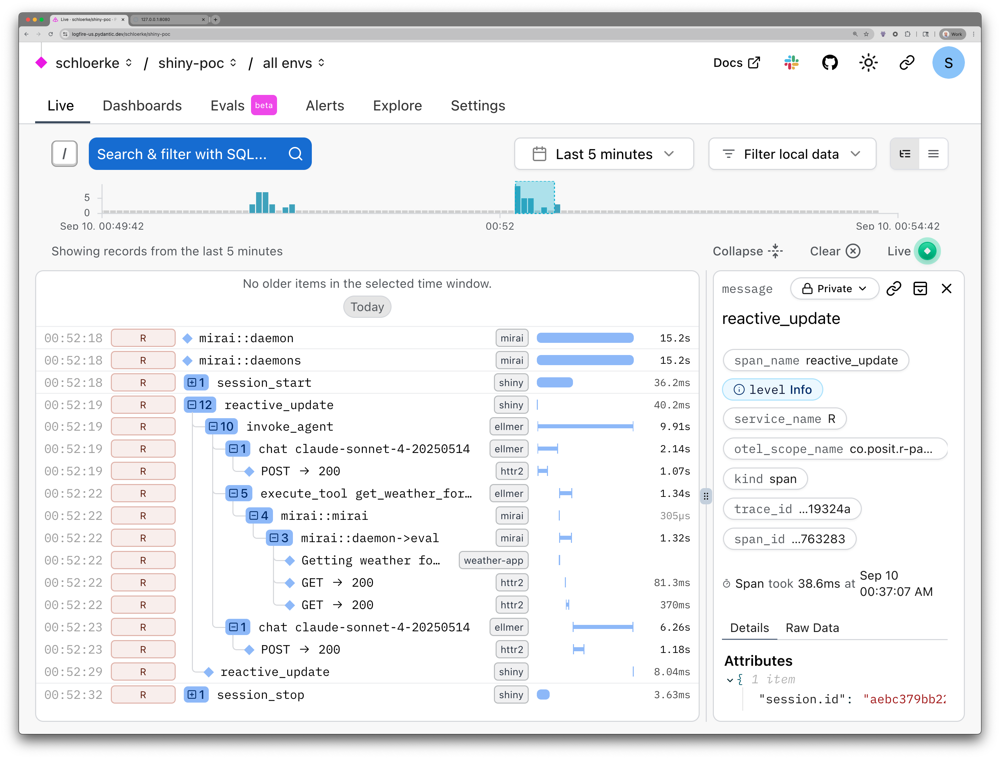

# Observability at scale: Monitoring Shiny Applications with OpenTelemetry

Slides: https://schloerke.com/presentation-2025-09-17-posit-conf-otel/

## Links

* OpenTelemetry: https://opentelemetry.io/
* `{shiny}`: https://shiny.posit.co/r/
* Supporting packages:
  * `{otel}`: https://otel.r-lib.org/
  * `{otelsdk}`: https://otelsdk.r-lib.org/
    * See https://otelsdk.r-lib.org/reference/collecting.html for more details on
      collecting traces for OpenTelemetry in R.
* Integrated packages:
  * `{ellmer}`: https://ellmer.tidyverse.org/
  * `{mirai}`: https://mirai.r-lib.org/
  * `{httr2}`: https://httr2.r-lib.org/


## Otel Setup

* An Anthropic API key; you can get one via the [Anthropic Console](https://console.anthropic.com/) (requires signup and credit card).

  Please include this in your `.Renviron` file or exported to your shell environment:

  ```bash
  ANTHROPIC_API_KEY=your_api_key_here
  ```

* [Pydantic Logfire](https://pydantic.dev/logfire) account (requires signup and credit card); First 10 million spans/metrics per month are free 🎉. I enjoyed their "Live" view that constantly updates to the last 5 minutes of logs. Absolutely wonderful for quick debugging 😍!

  Please include this in your `.Renviron` file or exported to your shell environment:

  ```bash
  OTEL_TRACES_EXPORTER=http
  OTEL_EXPORTER_OTLP_ENDPOINT="https://logfire-us.pydantic.dev"
  OTEL_EXPORTER_OTLP_HEADERS="Authorization=<your-write-token>"

  OTEL_LOGS_EXPORTER=http
  OTEL_LOG_LEVEL=debug
  ```

* Optional: To send traces to a [local collector](https://otelsdk.r-lib.org/reference/collecting.html#setup-for-local-collectors), I enjoyed using [Jaeger](https://otelsdk.r-lib.org/reference/collecting.html#jaeger).

  Update your `.Renviron` to only contain:
  ```bash
  OTEL_TRACES_EXPORTER=http
  ```

  Then run [Jaeger](https://www.jaegertracing.io/) in [Docker](https://www.docker.com/):

  ```bash
  docker run --rm --name jaeger \
  -p 16686:16686 \
  -p 4317:4317 \
  -p 4318:4318 \
  -p 5778:5778 \
  -p 9411:9411 \
  jaegertracing/jaeger:2.9.0
  ```

  View your OpenTelemetry traces locally at <http://localhost:16686>/


## Example

Small `{ellmer}` `{shinychat}` app in R with a single tool call to find the current weather.


Snapshot of a [Logfire](https://pydantic.dev/logfire) dashboard of the app (whose Otel spans have been heavily pruned for demo clarity):




-------------------------------

## Abstract

Understanding what happens behind the scenes in production Shiny applications
has always been challenging. When users experience slow response times or
unexpected behavior, developers are left guessing where bottlenecks occur. This
talk introduces OpenTelemetry integration for Shiny for R, a new approach to
profiling code and understanding application behavior.

Through a chat-enabled weather application, we'll explore how complex user
interactions trigger cascading events across multiple processes. You'll learn
how OpenTelemetry's "high-quality, ubiquitous, and portable telemetry" can
provide complete visibility into your Shiny application's performance with
minimal setup... just a few environment variables!

After walking through the chat app, you'll have a taste of how to implement
comprehensive monitoring for your Shiny applications in production, enabling you
to proactively identify and resolve unexpected performance issues.
